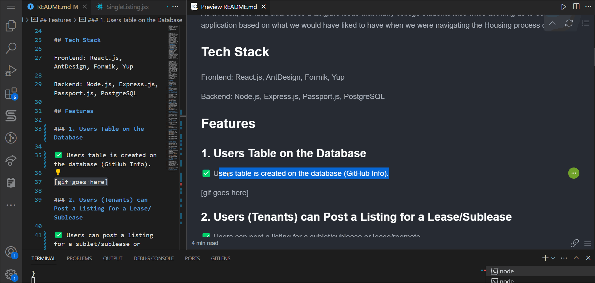
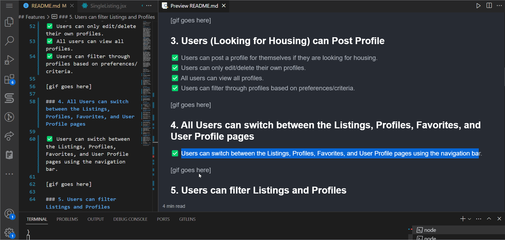
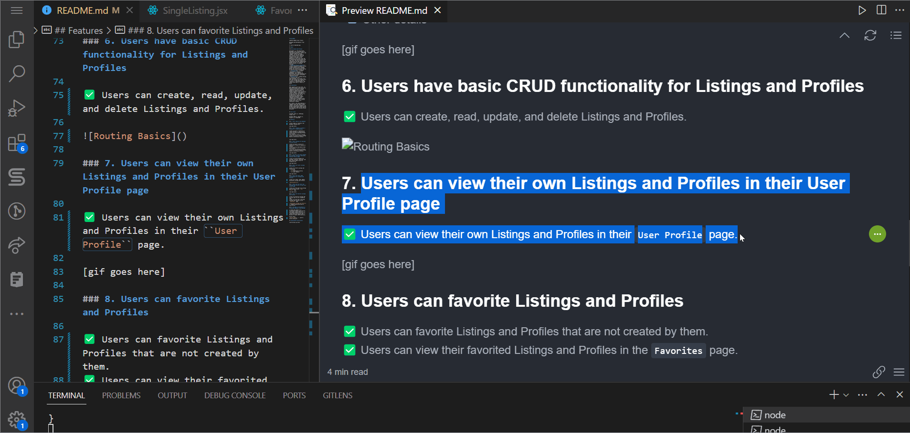

# HousingPal

CodePath WEB103 Final Project

Designed and developed by: Yash Patki

🔗 Link to deployed app: [HousingPal Web App](https://housingpal-codepath-client.up.railway.app/)

## About

### Description and Purpose

HousingPal is a web application designed to be a one-stop-shop to find sublets/subleases, leases, and roommates aimed at college students. As the name suggests, this platform aims to ease the housing process that college students go through at the beginning of each school year due to diminishing housing options and high costs. We focus primarily on transparency and open communication between parties to streamline the entire process for everyone involved. 
- **Dedicated Housing Platform** - Provide a purposeful medium to help college students secure housing without the reliance on Facebook Groups and other extraneous sources to scurry in search of housing. 
- **Transparency** - Provide transparency to tenants, subtenants, and roommates by displaying costs and preferences up front to help connect interested, compatible parties. 
- **Convenience** - Finding housing is stressful and very time-consuming, so our goal is to ease that process by allowing users to filter through what they are looking for, posting details, and contact each other if there's a match. 

### Inspiration

When speaking with each other, we had several ideas: applications for finding campus events, finding rideshares, syncing playlists between streaming services, and finding people to study within your classes. However, we decided to pursue this idea since both of us struggled due to the lack of housing during COVID-19 and experienced hardships finding roommates and leases using college-specific Facebook Groups, Discord chats, and other sources without much luck or with unnecessary troubles. 

As a result, this idea addresses a tangible issue that many college students face while allowing us to design an application based on what we would have liked to have when we were navigating the Housing process ourselves. 


## Tech Stack

Frontend: React.js, AntDesign, Formik, Yup

Backend: Node.js, Express.js, Passport.js, PostgreSQL

## Features

### 1. Users Table on the Database

✅ Users table is created on the database (GitHub Info).



### 2. Users (Tenants) can Post a Listing for a Lease/Sublease

✅ Users can post a listing for a sublet/sublease or lease/roomate.
✅ Users can only edit/delete their own listings.
✅ All users can view all listings.
✅ Users can click on individual listings to view more details.


### 3. Users (Looking for Housing) can Post Profile

✅ Users can post a profile for themselves if they are looking for housing.
✅ Users can only edit/delete their own profiles.
✅ All users can view all profiles.
✅ Users can click on individual profiles to view more details.


### 4. All Users can switch between the Listings, Profiles, Favorites, and User Profile pages

✅ Users can switch between the Listings, Profiles, Favorites, and User Profile pages using the navigation bar.



### 5. Users can filter Listings and Profiles

✅ Users can filter Listings and Profiles by:
  - [x] Cost
  - [x] Preferences/Criteria
  - [x] Other details


### 6. Users have basic CRUD functionality for Listings and Profiles

✅ Users can create, read, update, and delete Listings.


✅ Users can create, read, update, and delete Profiles.


### 7. Users can view their own Listings and Profiles in their User Profile page

✅ Users can view their own Listings and Profiles in their ``User Profile`` page.



### 8. Users can favorite Listings and Profiles

✅ Users can favorite Listings and Profiles that are not created by them.
✅ Users can view their favorited Listings and Profiles in the ``Favorites`` page.


### 9. All data is persisted in a PostgreSQL database using Railway

✅ Create and connect to a PostgreSQL database using Railway.
✅ All data is persisted in a PostgreSQL database using Railway.
✅ API routes are setup in the backend to handle CRUD operations.

Server Setup:


## Installation Instructions

### 1. Clone the repository

```
git clone
```

### 2. Install dependencies

```
npm install
```

### 3. Start the server

```
npm run start
```

### 4. Start the client

```
npm run dev
```

Note: Need to setup your own database using Railway and update the ``.env`` file with your own credentials.